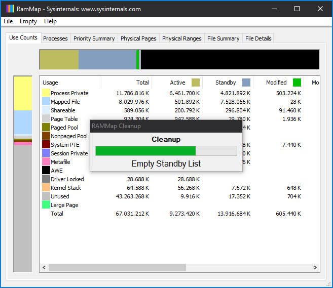

# RAMMap Cleanup

AutoHotKey automation for RAMMap.

**Support for automatic cleanup:**

- Empty Working Sets
- Empty System Working Set
- Empty Modified Page List
- Empty Standby List
- Empty Priority 0 Standby List



## Installation

The `build.cmd|ps1` scripts provide two capabilities:

- **Download** the latest RAMMap executable (Switch: `-DownloadRamMap`, Default: `false`)
- **Download** the latest AutoHotKey and **compile** the AutoHotKey script into a self contained executable (Switch: `-CompileExecutable`, Default: `true`)

> **Note:** The `build.cmd` is only a wrapper for `build.ps1` script!

The `clean.cmd` only remove the build artifacts from `build.cmd|ps1`!

### Example

Download RAMMap, download AutoHotKey and compile AutoHotKey script to EXE:

```cmd
build.cmd|ps1 -DownloadRamMap -CompileExecutable
```

The output is under `_build` directory:

```txt
_build
|   rammap-cleanup.exe
|   RAMMap.exe
|
\---ahk
    |   AutoHotkey.chm
    |   AutoHotkeyA32.exe
    |   AutoHotkeyU32.exe
    |   AutoHotkeyU64.exe
    |   Installer.ahk
    |   license.txt
    |   Template.ahk
    |   WindowSpy.ahk
    |
    \---Compiler
            Ahk2Exe.exe
            ANSI 32-bit.bin
            readme.txt
            Unicode 32-bit.bin
            Unicode 64-bit.bin
```

## Usage

> **NOTE:** Needs elevation and runs with administrative privileges.

### Run script

```cmd
AutoHotkey.exe src/rammap-cleanup.ahk
```

### Run compiled executable

```cmd
_build/rammap-cleanup.exe
```

### Commandline arguments

The first argument can be the path to an existing `RAMMap.exe` executable on the machine, e.g.:

```cmd
AutoHotkey.exe src/rammap-cleanup.ahk C:/Program Files/Sysint/RAMMap.exe
_build_/rammap-cleanup.exe C:/Program Files/Sysint/RAMMap.exe
```

> **NOTE:** If no path to `RAMMap.exe` is specified the AutoHotKey script search under the current  
> directory and then search for `RAMMap.exe` in all paths defined in the `PATH` environment variable.

## Contributing

1. Fork it!
2. Create your feature branch: `git checkout -b my-new-feature`
3. Commit your changes: `git commit -am 'Add some feature'`
4. Push to the branch: `git push origin my-new-feature`
5. Submit a pull request :D